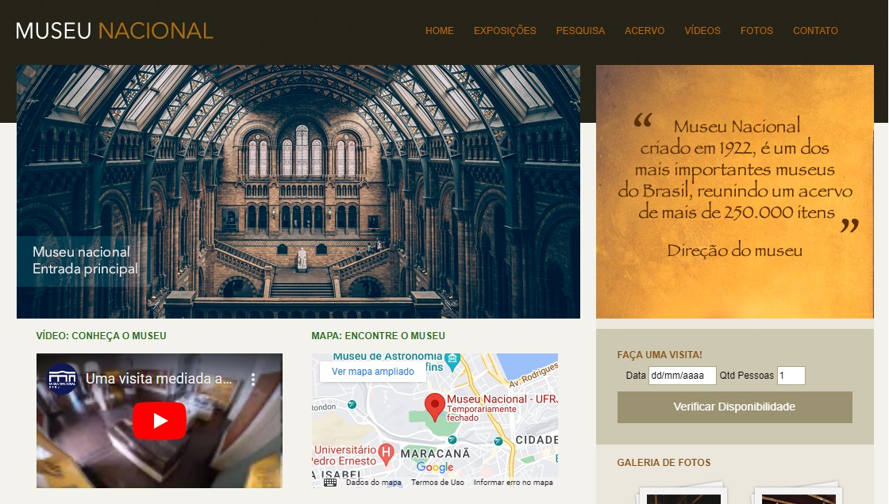

# National Museum

Welcome! 

This repository contains my solution for ficticious website of a museum using some special features of HTML5 and CSS3.

This project was developed during the [Complete Web Development](https://www.udemy.com/course/web-completo/) course (Section CSS3 - Special Resources) held at UDEMY.



# 🧠 About

The goal with this project is learn and practice about this functionalities below:

- [x] Normalize CSS
- [x] Box sizing
- [x] Shadows
- [x] Animations
- [x] Transitions
- [x] Header, Nav, Footer tags
- [x] Article, Section, Aside and Time tags
- [x] Inputs
- [x] Videos
- [x] Maps
- [x] Flexbox - Container

## 🖥️ Installation

1. Clone this repo
```bash
git clone https://github.com/robernar2011/NationalMuseum.git
```
